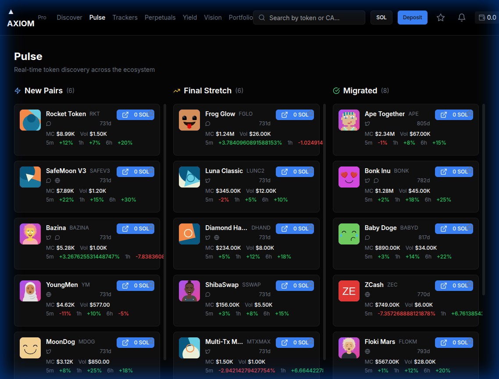

# Axiom Replica

A pixel-perfect replica of Axiom Trade's "Pulse" token discovery board, built with Next.js 14, TypeScript, Tailwind CSS, Redux Toolkit, and React Query.

## 📸 Screenshots

### Main Application

*Complete 3-column board layout with navigation, token cards, and real-time updates*

### Demo Video

*Interactive demo showing scrolling through all columns and features*

## ✨ Features

- **3-Column Board Layout**: Tokens organized by status (New Pairs, Final Stretch, Migrated)
- **Rich Token Cards**: 
  - Token image with gradient background
  - Name, symbol, and social links (Twitter, Telegram, Website)
  - Time since creation
  - Market cap, volume, and price changes (5m, 1h, 6h)
  - Interactive "Buy" button and favorite star
- **Real-time Updates**: Simulated WebSocket updates with smooth transitions
- **Trading System**: Buy/sell modal with balance validation and order tracking
- **Wallet Management**: Instant deposits with quick buttons or custom amounts
- **Profile & History**: Complete order history, favorites, and statistics
- **Working Search**: Filter tokens by name or symbol
- **Favorites System**: Star tokens to save them for quick access
- **Color-Coded Metrics**: Green for positive changes, red for negative
- **Atomic Design**: Modular component architecture
- **Performance**: Memoized components, optimized re-renders
- **Responsive**: Fully responsive down to 320px width

## Tech Stack

- **Framework**: Next.js 14 (App Router)
- **Language**: TypeScript (strict mode)
- **Styling**: Tailwind CSS, shadcn/ui
- **State Management**: Redux Toolkit (UI), React Query (Data)
- **Icons**: Lucide React
- **Images**: DiceBear API for avatars

## Installation Guide

### Prerequisites

- **Node.js**: Version 18.17 or higher
- **npm** or **yarn** or **pnpm**

Check your versions:
```bash
node --version  # Should be 18.17+
npm --version   # Should be 9.0+
```

### Step 1: Clone the Repository

```bash
git clone https://github.com/rohith1005H/axiom-replica.git
cd axiom-replica
```

### Step 2: Install Dependencies

#### All-in-One Installation
```bash
npm install
```

This will install all dependencies listed below.

#### Manual Installation (Step-by-Step)

If you prefer to understand what's being installed, here's the breakdown:

**1. Core Framework**
```bash
# Next.js 14 with React 18
npm install next@14.2.33 react@18 react-dom@18
```
- `next`: Next.js framework for React applications
- `react`: JavaScript library for building user interfaces
- `react-dom`: React package for DOM rendering

**2. TypeScript**
```bash
# TypeScript and type definitions
npm install --save-dev typescript @types/node @types/react @types/react-dom
```
- `typescript`: TypeScript compiler
- `@types/node`: Type definitions for Node.js
- `@types/react`: Type definitions for React
- `@types/react-dom`: Type definitions for React DOM

**3. State Management**
```bash
# Redux Toolkit for state management
npm install @reduxjs/toolkit react-redux

# React Query for server state and caching
npm install @tanstack/react-query
```
- `@reduxjs/toolkit`: Official Redux toolset with best practices
- `react-redux`: Official React bindings for Redux
- `@tanstack/react-query`: Data fetching and caching library

**4. Styling**
```bash
# Tailwind CSS and dependencies
npm install tailwindcss postcss autoprefixer

# Tailwind CSS utilities
npm install tailwindcss-animate class-variance-authority

# Utility for merging class names
npm install clsx tailwind-merge
```
- `tailwindcss`: Utility-first CSS framework
- `postcss`: CSS transformation tool
- `autoprefixer`: Adds vendor prefixes to CSS
- `tailwindcss-animate`: Tailwind CSS plugin for animations
- `class-variance-authority`: Type-safe variant APIs
- `clsx`: Utility for constructing class names
- `tailwind-merge`: Intelligently merges Tailwind CSS classes

**5. UI Components (Radix UI)**
```bash
# Radix UI primitives (used by shadcn/ui)
npm install @radix-ui/react-dialog
npm install @radix-ui/react-dropdown-menu
npm install @radix-ui/react-popover
npm install @radix-ui/react-tooltip
npm install @radix-ui/react-hover-card
npm install @radix-ui/react-tabs
npm install @radix-ui/react-slot
```
- All `@radix-ui` packages: Unstyled, accessible UI primitives

**6. Icons**
```bash
# Lucide React icons
npm install lucide-react
```
- `lucide-react`: Beautiful and consistent icon pack

**7. Utilities**
```bash
# HTTP client
npm install axios
```
- `axios`: Promise-based HTTP client (used for data fetching)

**8. Development Tools**
```bash
# ESLint for code quality
npm install --save-dev eslint eslint-config-next

# Tailwind CSS configuration
npx tailwindcss init -p
```
- `eslint`: JavaScript linter
- `eslint-config-next`: ESLint configuration for Next.js

### Step 3: Install shadcn/ui Components

The UI components are from shadcn/ui. Install them one by one:

```bash
# Initialize shadcn/ui (if not already done)
npx shadcn@latest init

# Install individual components
npx shadcn@latest add button
npx shadcn@latest add dialog
npx shadcn@latest add dropdown-menu
npx shadcn@latest add input
npx shadcn@latest add popover
npx shadcn@latest add tooltip
npx shadcn@latest add hover-card
npx shadcn@latest add skeleton
npx shadcn@latest add table
npx shadcn@latest add tabs
```

Each command will:
- Add the component to `src/components/ui/`
- Install any missing dependencies
- Update your `components.json` config

### Step 4: Verify Installation

Check that everything is installed correctly:

```bash
# Check package.json
cat package.json

# Verify all dependencies
npm list --depth=0
```

### Step 5: Run the Application

**Development Mode:**
```bash
npm run dev
```
Opens at [http://localhost:3000](http://localhost:3000)

**Production Build:**
```bash
npm run build
npm start
```

## Complete Dependency List

### Production Dependencies
| Package | Version | Purpose |
|---------|---------|---------|
| `next` | 14.2.33 | Next.js framework |
| `react` | ^18 | React library |
| `react-dom` | ^18 | React DOM rendering |
| `@reduxjs/toolkit` | ^2.0 | Redux state management |
| `react-redux` | ^9.0 | React-Redux bindings |
| `@tanstack/react-query` | ^5.0 | Data fetching/caching |
| `axios` | ^1.6 | HTTP client |
| `tailwindcss` | ^3.4 | CSS framework |
| `tailwindcss-animate` | ^1.0 | Tailwind animations |
| `class-variance-authority` | ^0.7 | Variant APIs |
| `clsx` | ^2.1 | Class name utility |
| `tailwind-merge` | ^2.2 | Tailwind merger |
| `lucide-react` | ^0.344 | Icon library |
| `@radix-ui/react-dialog` | ^1.0 | Dialog primitive |
| `@radix-ui/react-dropdown-menu` | ^2.0 | Dropdown primitive |
| `@radix-ui/react-popover` | ^1.0 | Popover primitive |
| `@radix-ui/react-tooltip` | ^1.0 | Tooltip primitive |
| `@radix-ui/react-hover-card` | ^1.0 | Hover card primitive |
| `@radix-ui/react-tabs` | ^1.0 | Tabs primitive |
| `@radix-ui/react-slot` | ^1.0 | Slot primitive |

### Development Dependencies
| Package | Version | Purpose |
|---------|---------|---------|
| `typescript` | ^5 | TypeScript compiler |
| `@types/node` | ^20 | Node.js types |
| `@types/react` | ^18 | React types |
| `@types/react-dom` | ^18 | React DOM types |
| `eslint` | ^8 | Code linter |
| `eslint-config-next` | 14.2.33 | Next.js ESLint config |
| `postcss` | ^8 | CSS processor |
| `autoprefixer` | ^10 | CSS autoprefixer |

## Troubleshooting

### Common Issues

**1. Node version too old**
```bash
# Update Node.js using nvm
nvm install 18
nvm use 18
```

**2. Permission errors**
```bash
# Use sudo (Linux/Mac) or run as administrator (Windows)
sudo npm install
```

**3. Package conflicts**
```bash
# Clear cache and reinstall
rm -rf node_modules package-lock.json
npm cache clean --force
npm install
```

**4. shadcn/ui components not installing**
```bash
# Make sure components.json exists
npx shadcn@latest init

# Then install components
npx shadcn@latest add button
```

**5. Build errors**
```bash
# Clear Next.js cache
rm -rf .next
npm run build
```

## Project Structure

```
axiom-replica/
├── src/
│   ├── app/                    # Next.js App Router
│   │   ├── layout.tsx          # Root layout with providers
│   │   ├── page.tsx            # Main page with Navigation & PulseBoard
│   │   └── globals.css         # Global styles and Tailwind imports
│   │
│   ├── components/             # UI Components (Atomic Design)
│   │   ├── atoms/              # Basic building blocks
│   │   │   ├── PriceCell.tsx        # Displays token price with flash animation
│   │   │   ├── StatusBadge.tsx      # Status indicator (New/Final/Migrated)
│   │   │   └── SkeletonRow.tsx      # Loading skeleton for tables
│   │   │
│   │   ├── molecules/          # Composite components
│   │   │   ├── TokenCard.tsx        # Main token card with all details & interactions
│   │   │   ├── BuySellModal.tsx     # Trading modal with buy/sell tabs
│   │   │   ├── DepositModal.tsx     # Wallet deposit interface
│   │   │   ├── ProfileModal.tsx     # User profile with orders/favorites/stats
│   │   │   ├── FavoritesModal.tsx   # View all favorited tokens
│   │   │   ├── SortableHeader.tsx   # Table header with sort functionality
│   │   │   ├── ActionPopover.tsx    # Buy/Sell action menu
│   │   │   ├── TokenHoverCard.tsx   # Hover info for tokens
│   │   │   ├── TokenRow.tsx         # Table row (legacy, for old table view)
│   │   │   └── FilterGroup.tsx      # Search & filter controls (legacy)
│   │   │
│   │   ├── organisms/          # Major sections
│   │   │   ├── Navigation.tsx       # Top navigation bar with all controls
│   │   │   ├── PulseBoard.tsx       # Main 3-column board orchestrator
│   │   │   └── TokenColumn.tsx      # Column container for status groups
│   │   │
│   │   ├── providers/          # Context providers
│   │   │   ├── StoreProvider.tsx    # Redux store provider
│   │   │   └── QueryProvider.tsx    # React Query provider
│   │   │
│   │   └── ui/                 # shadcn/ui components
│   │       ├── button.tsx           # Button component
│   │       ├── dialog.tsx           # Modal dialog
│   │       ├── dropdown-menu.tsx    # Dropdown menu
│   │       ├── input.tsx            # Text input
│   │       ├── tabs.tsx             # Tabbed interface
│   │       ├── table.tsx            # Table components
│   │       ├── popover.tsx          # Popover
│   │       ├── tooltip.tsx          # Tooltip
│   │       ├── hover-card.tsx       # Hover card
│   │       └── skeleton.tsx         # Loading skeleton
│   │
│   ├── lib/                    # Utilities and configuration
│   │   ├── redux/              # Redux state management
│   │   │   ├── store.ts             # Redux store configuration
│   │   │   ├── hooks.ts             # Typed Redux hooks
│   │   │   └── slices/              # State slices
│   │   │       ├── tableSlice.ts         # Table UI state (sort, filter, search)
│   │   │       ├── socketSlice.ts        # WebSocket connection status
│   │   │       ├── favoritesSlice.ts     # Favorited token IDs
│   │   │       └── walletSlice.ts        # Wallet balance & order history
│   │   │
│   │   └── utils.ts            # Utility functions (cn for className merging)
│   │
│   ├── hooks/                  # Custom React hooks
│   │   ├── useLiveTableData.ts      # Fetches & merges live data with filters
│   │   └── useMockWebSocket.ts      # Simulates real-time WebSocket updates
│   │
│   ├── services/               # External services and data
│   │   └── mockData.json            # 20 mock tokens with full details
│   │
│   └── types/                  # TypeScript type definitions
│       └── index.ts                 # All app types (TokenData, Order, etc.)
│
├── public/                     # Static assets
│   └── *.svg                   # Next.js default icons
│
├── Configuration Files
├── .eslintrc.json              # ESLint configuration
├── .gitignore                  # Git ignore patterns
├── components.json             # shadcn/ui configuration
├── next.config.mjs             # Next.js configuration
├── package.json                # Dependencies and scripts
├── postcss.config.mjs          # PostCSS configuration
├── tailwind.config.ts          # Tailwind CSS configuration
├── tsconfig.json               # TypeScript configuration
└── README.md                   # This file
```

## Key Files Explained

### Core Application

#### `src/app/layout.tsx`
Root layout that wraps the entire application. Configures:
- Inter font from Google Fonts
- Page metadata (title, description)
- StoreProvider (Redux state)
- QueryProvider (React Query)
- Dark mode theme

#### `src/app/page.tsx`
Main application page that renders:
- Navigation component (top bar)
- PulseBoard component (3-column board)
- Page title and description

#### `src/app/globals.css`
Global styles including:
- Tailwind CSS imports
- CSS variables for shadcn/ui dark theme
- Custom scrollbar styles
- Base styling resets

### State Management (Redux)

#### `src/lib/redux/store.ts`
Configures the Redux store combining all slices:
- `table`: UI state for sorting, filtering, searching
- `socket`: WebSocket connection status
- `favorites`: Array of favorited token IDs
- `wallet`: Balance and order history

#### `src/lib/redux/slices/tableSlice.ts`
Manages table UI state:
- `activeColumn`: Current sort column
- `sortDirection`: Ascending or descending
- `filterStatus`: Filter by token status
- `searchQuery`: Search term for filtering tokens

#### `src/lib/redux/slices/favoritesSlice.ts`
Manages favorited tokens:
- `favoriteIds`: Array of token IDs
- `toggleFavorite`: Add/remove from favorites
- `clearFavorites`: Remove all favorites

#### `src/lib/redux/slices/walletSlice.ts`
Manages wallet and trading:
- `balance`: Current SOL balance
- `orders`: Array of all buy/sell orders
- `deposit`: Add funds to balance
- `addOrder`: Record a new trade

#### `src/lib/redux/slices/socketSlice.ts`
Manages WebSocket connection:
- `isConnected`: Connection status
- `lastUpdate`: Timestamp of last update

### Data & Types

#### `src/types/index.ts`
Defines all TypeScript types:
- `TokenStatus`: 'New Pairs' | 'Final Stretch' | 'Migrated'
- `TokenData`: Complete token information
- `Order`: Trade order details
- `WebSocketMessage`: Real-time update structure
- `TableState`: UI state shape

#### `src/services/mockData.json`
Contains 20 mock tokens with:
- Basic info (name, symbol, image)
- Price and market data
- Social links (Twitter, Telegram, Website)
- Holder and transaction counts
- Price changes (5m, 1h, 6h intervals)
- Liquidity and tax information

### Custom Hooks

#### `src/hooks/useLiveTableData.ts`
Main data hook that:
- Fetches initial token data from JSON
- Subscribes to WebSocket updates
- Merges real-time changes
- Applies search, filter, and sort
- Returns processed token array

#### `src/hooks/useMockWebSocket.ts`
Simulates WebSocket connection:
- Emits random price updates every second
- Simulates status changes
- Triggers Redux updates
- Can be enabled/disabled

### Components - Organisms

#### `src/components/organisms/Navigation.tsx`
Top navigation bar featuring:
- Logo and menu links
- Working search bar (filters tokens)
- Chain selector dropdown (SOL/ETH)
- Deposit button (opens modal)
- Favorites icon with count badge
- Notifications bell
- Wallet balance display
- Profile dropdown menu

#### `src/components/organisms/PulseBoard.tsx`
Main board orchestrator:
- Fetches live token data
- Groups tokens by status
- Renders 3 TokenColumn components
- Shows loading state

#### `src/components/organisms/TokenColumn.tsx`
Status-based column:
- Receives tokens for one status
- Shows column header with icon
- Displays token count
- Renders TokenCard for each token
- Custom scrollbar styling

### Components - Molecules

#### `src/components/molecules/TokenCard.tsx`
Rich token card featuring:
- Token image with gradient background
- Name, symbol, and creation time
- Social media links (clickable icons)
- Market cap and volume
- Price changes with color coding
- Always-visible favorite star
- Buy button (opens trading modal)
- Hover effects and transitions

#### `src/components/molecules/BuySellModal.tsx`
Trading interface with:
- Tabbed layout (Buy/Sell)
- Token info header with image
- Current price display
- User balance validation
- SOL amount input
- Token amount calculation
- Quick amount buttons
- Trade execution (creates orders)
- Market stats footer

#### `src/components/molecules/DepositModal.tsx`
Wallet deposit interface:
- Quick deposit buttons (1, 5, 10, 50 SOL)
- Custom amount input
- Instant deposit (no validation)
- Updates balance immediately

#### `src/components/molecules/ProfileModal.tsx`
User profile with 3 tabs:
- **Orders**: Complete trading history
  - Buy/sell indicators
  - Token details and amounts
  - Timestamps
- **Favorites**: All starred tokens
- **Stats**: Trading statistics
  - Total orders, favorites
  - Buy/sell counts
  - Wallet balance

#### `src/components/molecules/FavoritesModal.tsx`
Favorites viewer:
- Lists all favorited tokens
- Renders TokenCard for each
- Empty state message
- Scrollable list

### Components - Atoms

#### `src/components/atoms/PriceCell.tsx`
Animated price display:
- Shows token price
- Flash animation on change (green/red)
- Detects value changes
- Smooth transitions

#### `src/components/atoms/StatusBadge.tsx`
Status indicator badge:
- Color-coded by status
- Blue: New Pairs
- Yellow: Final Stretch
- Green: Migrated
- Rounded pill design

### Providers

#### `src/components/providers/StoreProvider.tsx`
Redux store provider:
- Creates store instance once
- Provides store to entire app
- Uses client-side rendering

#### `src/components/providers/QueryProvider.tsx`
React Query provider:
- Configures QueryClient
- Sets default options (staleTime)
- Wraps app for data fetching

## Data Flow

1. **Initial Load**: 
   - `useLiveTableData` fetches from `mockData.json`
   - Data flows to `PulseBoard`
   - `PulseBoard` groups by status
   - Each `TokenColumn` receives its tokens

2. **Real-time Updates**:
   - `useMockWebSocket` emits updates every second
   - Updates dispatched to Redux (`socketSlice`)
   - `useLiveTableData` merges updates with static data
   - Components re-render with new data

3. **User Actions**:
   - Search: Dispatched to `tableSlice` → filters data
   - Favorite: Dispatched to `favoritesSlice` → updates star icons
   - Deposit: Dispatched to `walletSlice` → updates balance
   - Trade: Creates order in `walletSlice` → updates balance

## Deployment

### Vercel (Recommended)
1. Push to GitHub (already done!)
2. Go to [vercel.com](https://vercel.com)
3. Import your repository
4. Deploy (no configuration needed)

### Other Platforms
- **Netlify**: Connect GitHub repo, build command: `npm run build`
- **Railway**: Auto-detects Next.js, deploys automatically
- **Docker**: Use included `next.config.mjs` for standalone output

## Scripts

```bash
npm run dev      # Start development server (localhost:3000)
npm run build    # Create production build
npm start        # Start production server
npm run lint     # Run ESLint
```

## Architecture Highlights

- **Atomic Design**: Components organized by complexity (atoms → molecules → organisms)
- **Type Safety**: Strict TypeScript throughout
- **State Management**: Redux for UI state, React Query for server state
- **Performance**: Memoized components, optimized re-renders
- **Modularity**: Each component has single responsibility
- **Scalability**: Easy to add new token sources, columns, or features

## Future Enhancements

- Connect to real Solana blockchain
- Integrate wallet adapters (Phantom, Solflare)
- Real-time WebSocket connection
- Historical price charts
- Token swap functionality
- Portfolio tracking
- Price alerts
